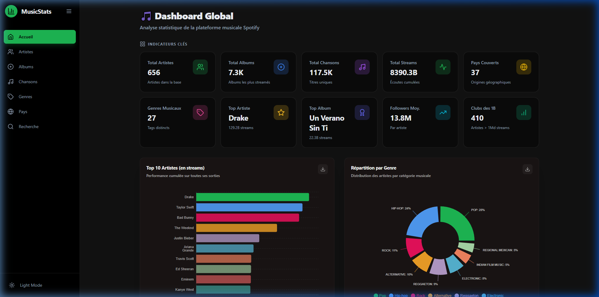
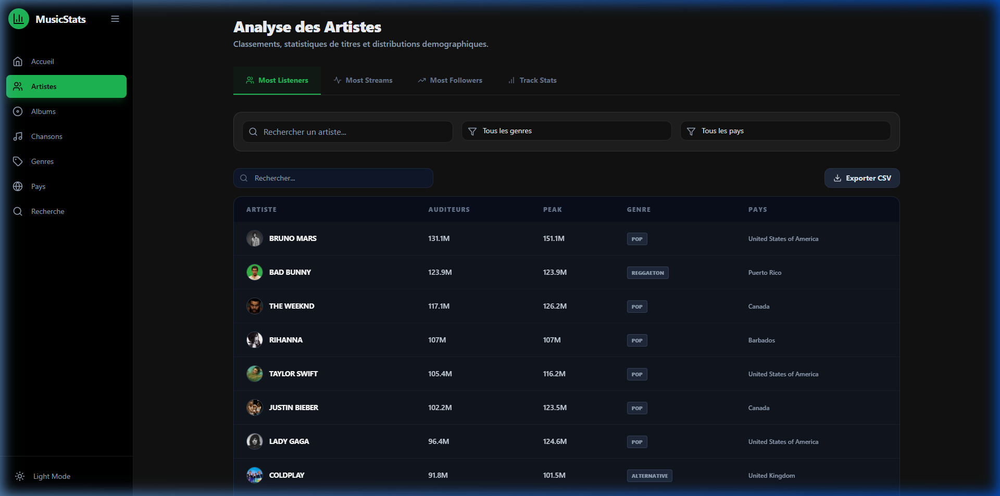
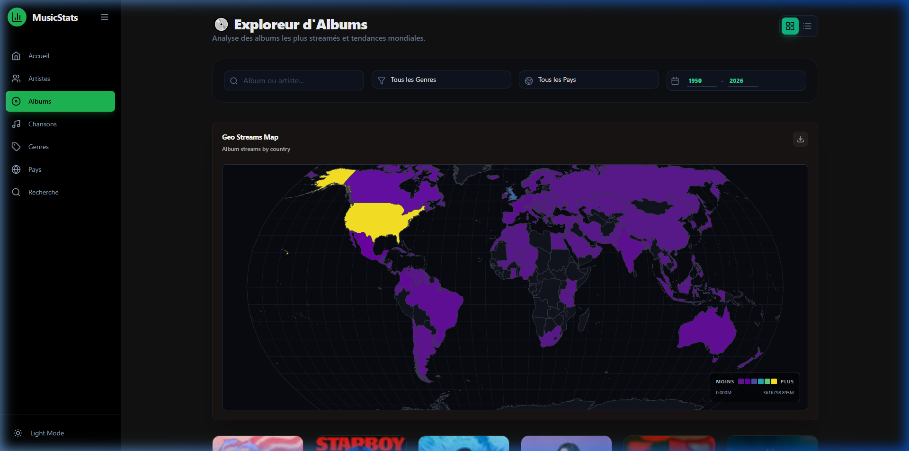
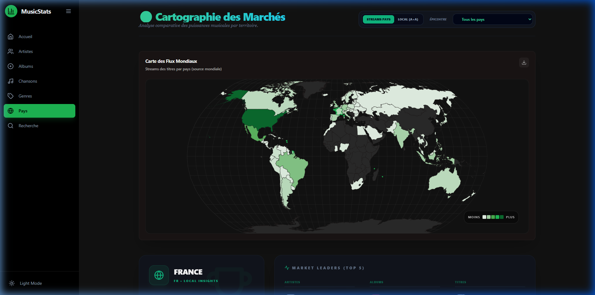
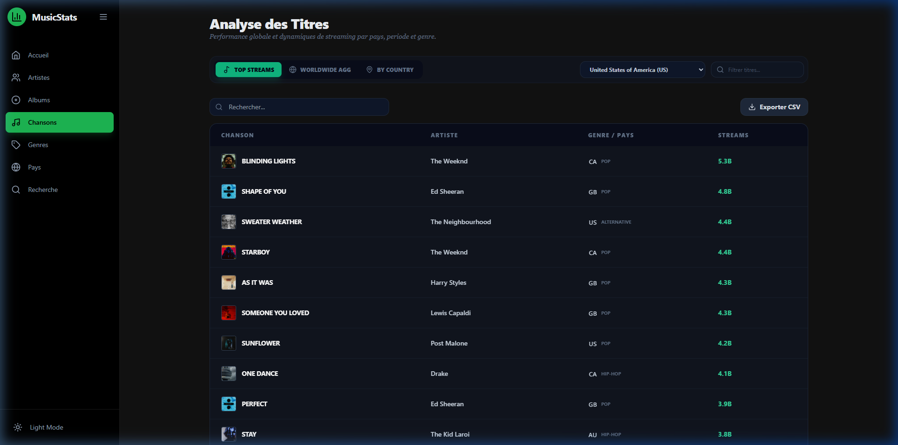

# 🎵 Spotify Music Analysis Platform

A powerful, full-stack music analytics dashboard with a sleek Spotify-inspired dark theme. Visualize streaming data, explore artists, songs, and global music trends through interactive charts and maps.

## ✨ Features

- 📊 **Interactive Dashboard**: Real-time analytics with key performance indicators and streaming trends.
- 🎤 **Artist Analysis**: Detailed stats on listeners, streams, and demographic distribution.
- 📀 **Album Explorer**: Geographic streaming maps and album-specific insights.
- 🎵 **Song Analytics**: Browse top streamed tracks with advanced filtering.
- 🌍 **Global Market Insights**: Interactive choropleth maps showing music popularity by country.
- 🔍 **Global Search**: Find your favorite artists, albums or songs instantly.
- 🌓 **Dynamic Themes**: Spotify-inspired UI with smooth Framer Motion animations.

## 📸 Screenshots

| Dashboard | Artists Analysis |
| :---: | :---: |
|  |  |

| Albums Explorer | Global Markets |
| :---: | :---: |
|  |  |

| Songs Analytics |
| :---: |
|  |

## 🛠️ Tech Stack

### Frontend
- **React 18 + Vite** (Fast development and optimized builds)
- **Tailwind CSS** (Modern, responsive styling)
- **Recharts** (Interactive data visualization)
- **Framer Motion** (Smooth UI transitions and animations)
- **Lucide React** (Beautiful, consistent iconography)

### Backend
- **Node.js + Express.js** (Robust API layer)
- **MySQL** (Relational database for complex queries)
- **CORS & Dotenv** (Security and environment configuration)

## 📁 Project Structure

```text
Music-analysis-platform-Spotify-/
├── Music_analysis_platform/
│   ├── backend/             # Node.js + Express Server
│   │   ├── controllers/     # API request handlers
│   │   ├── routes/          # Express route definitions
│   │   ├── server.js        # Entry point
│   │   └── .env             # Configuration
│   └── frontend/            # React + Vite Client
│       ├── src/
│       │   ├── components/  # Reusable UI parts
│       │   ├── pages/       # Page components
│       │   └── App.jsx      # Root component
│       └── package.json
└── screenshots/             # Application screenshots
```

## 🚀 Setup & Installation

### 1. Clone the Repository
```bash
git clone <repository-url>
cd Music-analysis-platform-Spotify-
```

### 2. Database Configuration
1. Create a MySQL database named `music_analysis_platform_for_spotify`.
2. Import your music data (CSV/SQL) into the database.

### 3. Environment Setup
Navigate to the backend folder and configure your credentials:
```bash
cd Music_analysis_platform/backend
# Ensure your .env file has the following:
PORT=5000
DB_HOST=localhost
DB_USER=your_username
DB_PASSWORD=your_password
DB_NAME=music_analysis_platform_for_spotify
```

### 4. Running the Application

#### Start the Backend
```bash
cd Music_analysis_platform/backend
npm install
npm run dev
```

#### Start the Frontend
```bash
cd Music_analysis_platform/frontend
npm install
npm run dev
```

The application will be available at `http://localhost:5173/`.

## 🎨 Official Palette

- **Primary Green**: `#1DB954`
- **Dark Background**: `#121212`
- **Elevated Surfaces**: `#1E1E1E`
- **Text Primary**: `#FFFFFF`
- **Text Secondary**: `#B3B3B3`

## 📄 License
This project is licensed under the ISC License.
