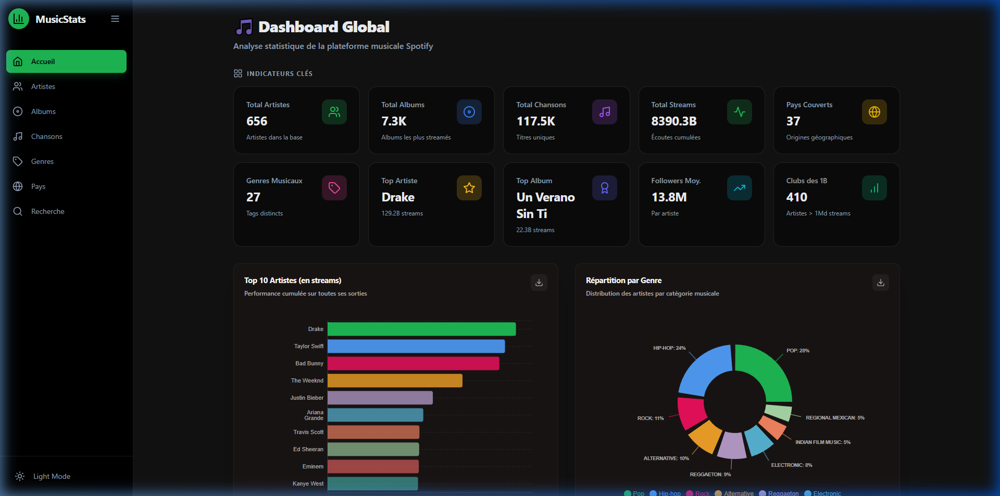
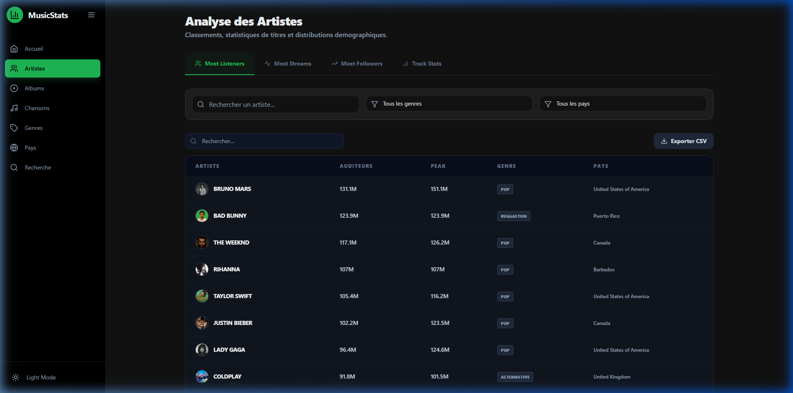
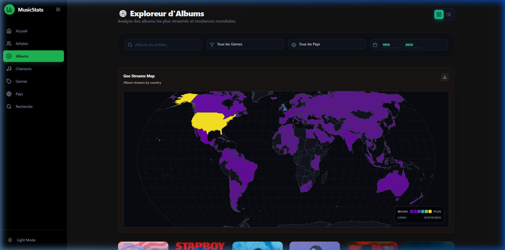
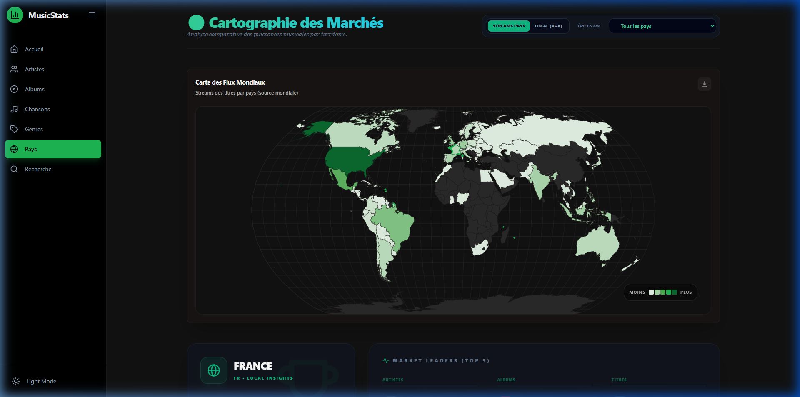
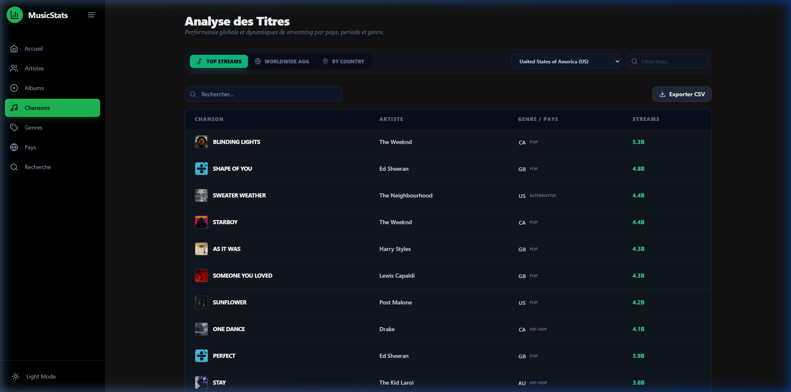

# 🎵 Spotify Music Analysis Platform

A comprehensive, full-stack ecosystem for music data engineering and interactive visualization. This platform combines a sleek web dashboard with a robust data pipeline and Python-based analytical suites.

---

## ✨ Features

### 📊 Interactive Web Dashboard
- **Real-time KPI Cards**: Monitor global streaming trends and key performance metrics.
- **Dynamic Charts**: Interactive Recharts for analyzing artist performance and listener demographics.
- **Geographic Insights**: Choropleth maps visualizing music popularity across different countries.
- **Global Search**: Instantly find any artist, album, or track in the system.

### ⚙️ Data Engineering Pipeline
- **Automated Scraping**: Custom scripts to gather raw music data from various sources.
- **API Enrichment**: Filling missing information (metadata, popularity) using the Spotify API.
- **Data Refining**: Multi-stage cleaning and merging processes to ensure data integrity.
- **Relational Storage**: Optimized MySQL schema for complex relational queries.

### 📈 Python Analytics Suite
- **Static Reporting**: Generate high-quality PNG charts for genre distribution and artist trends.
- **Data Exploration**: Histograms and performance charts for deep-dive analysis.

---

## 📸 Screenshots

| Dashboard | Artists Analysis |
| :---: | :---: |
|  |  |

| Albums Explorer | Global Markets |
| :---: | :---: |
|  |  |

| Songs Analytics |
| :---: |
|  |

---

## 🛠️ Tech Stack

### Frontend
- **React 18 + Vite** (Fast development and optimized builds)
- **Tailwind CSS** (Modern, responsive styling)
- **Recharts** (Interactive data visualization)
- **Framer Motion** (Smooth UI transitions and animations)
- **Lucide React** (Beautiful, consistent iconography)

### Backend
- **Node.js + Express.js** (Robust API layer)
- **MySQL** (Relational database for complex queries)
- **CORS & Dotenv** (Security and environment configuration)

### Data Science & Engineering
- **Python, Pandas, Matplotlib, Seaborn**
- **Spotify Web API integrations**

---

## 📁 Project Structure

```text
Music-analysis-platform-Spotify-/
├── Music_analysis_platform/
│   ├── backend/             # Node.js + Express API
│   └── frontend/            # React + Vite Application
├── Data/                    # Raw and processed datasets (CSV/SQL)
├── Scripts/                 # The Data Pipeline
│   ├── Scraping/            # Data collection
│   ├── Filling_missing_info # API integration
│   ├── Cleaning/            # Data normalization
│   └── Merge/               # Combining datasets
├── Visualization_Python/    # Python-based analytical charts
├── mysql/                   # Database export and schemas
└── screenshots/             # Visual documentation
```

---

## 🚀 Setup & Installation

### 1. Clone the Repository
```bash
git clone <repository-url>
cd Music-analysis-platform-Spotify-
```

### 2. Database Configuration
1. Create a MySQL database named `music_analysis_platform_for_spotify`.
2. Import your music data (CSV/SQL) into the database from the `mysql/` directory.

### 3. Environment Setup
Navigate to the backend folder and configure your credentials:
```bash
cd Music_analysis_platform/backend
# Ensure your .env file has the following:
PORT=5000
DB_HOST=localhost
DB_USER=your_username
DB_PASSWORD=your_password
DB_NAME=music_analysis_platform_for_spotify
```

### 4. Running the Application

#### Start the Backend
```bash
cd Music_analysis_platform/backend
npm install
npm run dev
```

#### Start the Frontend
```bash
cd Music_analysis_platform/frontend
npm install
npm run dev
```

The application will be available at `http://localhost:5173/`.

---

## 📊 Running Python Visualizations
To generate static charts, navigate to `Visualization_Python/`:
```bash
pip install pandas matplotlib seaborn
python artist_performance_charts.py
```

---

## 📄 License
This project is licensed under the **ISC License**.
